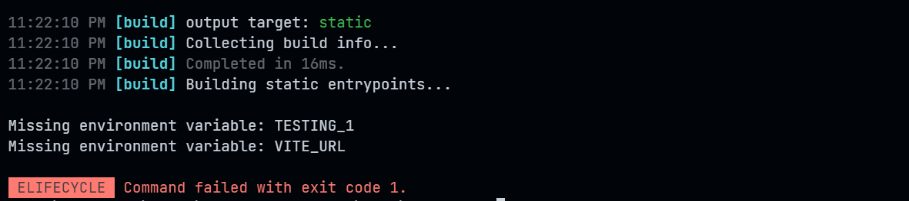

# vite-require-env-var

Vite.js plugin that makes build fail if a required environment variable(s) is missing.

It supports all .env.\* files (even combined)

- .env
- .env.local
- .env.[mode]



# 1. Installation

## 1.1 Install dependency

```sh
# npm
npm i -D vite-require-env-var

# yarn
yarn add -D vite-require-env-var

# pnpm
pnpm add -D vite-require-env-var
```

## 1.2 Add to Vite configuration file

```ts
import { defineConfig } from "vite";
import { requireEnvVar } from "vite-require-env-var";

export default defineConfig({
  plugins: [requireEnvVar(["VARIABLE_1", "VITE_URL"])],
});
```
